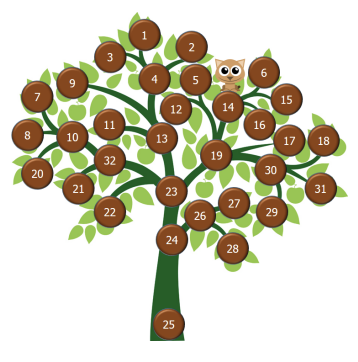

## Kitten on a Tree
Ouch! A kitten got stuck on a tree. Fortunately, the
tree’s branches are numbered. Given a description
of a tree and the position of the kitten, can you write
a program to help the kitten down?
## Input
The input is a description of a single tree. The first
line contains an integer K, denoting the branch on
which the kitten got stuck. The next lines each contain two or more integers a, b1, b2, . . .. Each such
line denotes a branching: the kitten can reach a
from b1, b2, . . . on its way down. Thus, a will be
closer to the root than any of the bi.
## The description
ends with a line containing -1. Each branch bi will
appear on exactly one line. All branch numbers are
in the range 1..100, though not necessarily contiguous. You are guaranteed that there is a path from
every listed branch to the root. The kitten will sit
on a branch that has a number that is different than the root.
The illustration above corresponds to the sample input.
## Output
Output the path to the ground, starting with the branch on which the kitten sits.

<table> 
<tr><th>Input</th><th>Output</th></tr>
<tr>
  <td>
14  
25 24  
4 3 1 2  
13 9 4 11  
10 20 8 7  
32 10 21  
23 13 19 32 22  
19 12 5 14 17 30  
14 6 15 16  
30 18 31 29  
24 23 26  
26 27 28  
-1  
</td>
  <td>14 19 23 24 25</td>
</tr>